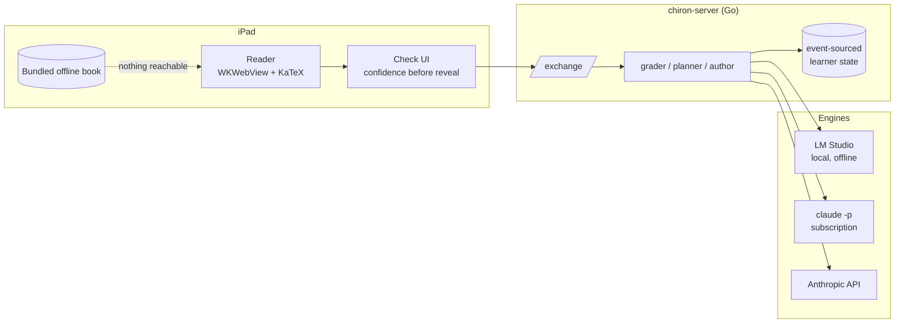

# Chiron

An adaptive textbook. You read a chapter, work the exercises inside it, take a
comprehension check, and the next chapter is written for the learner the check
says you are.

The first subject teaches how large language models work, from next-token
prediction to mixture-of-experts, with the real equations. It was built to be
read on a plane, offline, in one sitting.

<p align="center">
  
</p>

## Why it is built this way

The design follows the evidence on what actually moves learning, which is not
what an "AI textbook" usually does.

**Interaction lives inside the chapter, not after it.** A chapter-terminal quiz
is answer-based tutoring, the weakest form. The gains are in step-level work, so
every chapter carries 6-10 *beats* - predict the next step, fill in a blanked
derivation, explain why a term is there - that you commit to before the reveal.

**Wrong models are the teaching material.** Every unit ships a misconception
bank: the wrong model, why it is appealing, and *the specific prediction it
makes that observably fails*. Chapters are written in refutation structure and
every multiple-choice distractor cites a bank entry, so a wrong answer is a
diagnosis rather than a miss.

**Remediation switches representation.** Failing a gate does not re-present the
same text more slowly - that is the documented failure of mastery programs. It
swaps symbolic for numeric, or geometric, or code.

**The gate is a default, not a wall.** Below 80% you are held, but you can
always override. Overriding accrues *knowledge debt*, and "catch me up" later
generates one consolidated chapter covering everything skipped.

**Confidence is recorded before every reveal.** High-confidence-wrong is a
misconception and gets refuted; low-confidence-right is fragile and comes back
as a callback. Checks are cumulative - roughly 60% current unit, 40% earlier
material weighted toward what you got wrong.

**The model supplies judgement, code supplies everything else.** Mastery
updates, the prerequisite graph, gating, debt and check composition are
deterministic. What gets asked decides what you retain; it should not vary with
a model's mood.

## Shape



Reading is fully detached. The app talks to the server only at a chapter
boundary: everything that happened goes up in one request, and grades, the gate
result, the next chapter and updated state come back. Three transports, in
order of preference: Wi-Fi, a USB bridge through `usbmuxd`, and - if nothing is
reachable at all - a book bundled into the app with the checks graded in
JavaScript.

## Layout

| Path | What it is |
|---|---|
| `corpus/` | The authored subject: 11 units, each with canon, three depth variants, a question bank and unit-local misconceptions |
| `server-go/` | The service. Nine packages, one static binary |
| `server/` | The original Python implementation, kept as the reference the Go port was proven against |
| `ipad-app/` | SwiftUI client, built with xcodegen |
| `scripts/` | Flight-day runbook scripts and sprite deployment |
| `FLIGHT.md` | Operational runbook and status |
| `DESIGN-v2-sprite.md` | The hosted-tutor design and what is built |

## Running it

```bash
# the service
cd server-go && go build -o ../bin/chiron-server ./cmd/chiron-server
cd ../server && ../bin/chiron-server -addr 0.0.0.0:8080 -config config.yaml

# check the corpus
go build -o ../bin/corpus-lint ./cmd/corpus-lint && ../bin/corpus-lint corpus

# the app
cd ipad-app && xcodegen generate && open Chiron.xcodeproj
```

`server/config.yaml` picks the engine with `provider:` - omit it for an
OpenAI-compatible endpoint (LM Studio), `claude-cli` for headless Claude Code on
a subscription, `anthropic` for the API. `CHIRON_PROVIDER` overrides it without
editing the file.

Bind to `0.0.0.0`. A loopback bind leaves the tablet unable to reach the server,
which presents as the app hanging rather than as a server problem.

## Tests

```bash
cd server-go && go test ./...                       # unit and API tests
cd server && .venv/bin/python test_sim_learners.py  # simulated learners
CHIRON_TEST_BASE=http://host:8080 .venv/bin/python test_sim_learners.py
```

The simulated learners are the interesting ones: a strong learner who should
clear gates and unlock extensions, a weak learner who should be held with the
representation actually switched, and a skipper who should accrue debt and get a
coherent catch-up chapter. `CHIRON_TEST_BASE` points them at any running server,
which is how the Go port was checked against the Python one.

The mechanical grading rules are duplicated in three places - Go, Python, and
the offline JavaScript grader - because a beat is graded in the browser while
reading and on the server at the boundary. `checkers_test.go` and
`test_checkers.py` pin that contract. If you change one, change all three.

## Generating a new subject

In the app: **Library -> "Teach me something else"**. It asks until it can
write a brief, then plans a syllabus and authors every unit against
`corpus/authoring-spec.md`, which is subject-agnostic. `/teach/jobs` reports
progress; the subject appears in the library once every unit exists.

From a shell, the same pipeline in stages:

```bash
cd server
CHIRON_PROVIDER=claude-cli .venv/bin/python generate_subject.py plan  <slug> "<brief>"
CHIRON_PROVIDER=claude-cli .venv/bin/python generate_subject.py units <slug>
../bin/corpus-lint ../corpus-<slug>
```

Budget around 30 minutes per unit. Units are written one file per call and skip
files already on disk, so an interrupted run resumes rather than re-paying -
asking for a whole unit in one response produced a 30k-token reply that ran past
ten minutes and failed as a unit.

Output lands in `corpus-<slug>/` and the server discovers it at boot; there is
no config to edit, and a half-generated corpus stays invisible rather than
appearing as a book with missing chapters.

**A generated subject is unverified prose until someone reads it.** `corpus-lint`
covers the mechanical half - tolerances that would accept the error an item
exists to catch, answers a program cannot compare, distractors citing
misconceptions that do not exist, depth headings drifted from canon. The
judgement-heavy half (is this claim true? does this rubric adjudicate?) has no
substitute yet.

## Status

Working and used. The full loop has run end to end on real hardware against both
a local model and a hosted one. See `FLIGHT.md` for what is verified, what is
not, and the failures that cost real time - the tolerance rule that accepted
answers double the correct one, the markdown escaping that corrupted every
equation, the flag that made a model discard its own work.

## Licence and credits

Personal project, no licence granted yet. The centaur logo is a placeholder and
is not cleared for redistribution. KaTeX is bundled under the MIT licence.
