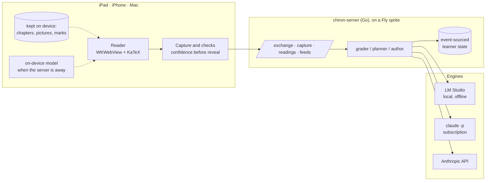

# Chiron

Chiron is an adaptive textbook that teaches from whatever you want to learn
about. It writes books and primers to order, reads the things you already
wanted to read - imported EPUBs, PDFs, web pages, blogs you follow - and keeps
all of it on one shelf. The point of putting them together is the highlight: a
passage you mark in anything on that shelf reaches the tutor with the whole
chapter behind it, so the answer is about the argument you are reading rather
than a sentence torn out of it. What it writes for you is shaped by what you
have read and answered, which it remembers.

A server holds the material and the learner record; apps for iPad, iPhone and
the Mac read from it and sync, so a chapter you mark up on one device is marked
up on the others. Reading works with the server out of reach, and on recent
Apple hardware a question asked offline is answered by the on-device model from
the chapter alone rather than not at all.

<p align="center">
  
</p>

## What it looks like

| | |
|---|---|
|  |  |
| **The library.** Books it wrote, blogs followed by feed, pages and documents saved to read - all as cards on one shelf. | **A page read in Chiron.** Any URL comes in as its own article, with its code and pictures kept, ready to highlight. |
|  |  |
| **Capture.** Highlight anything, ask a question, and say how much you want back: a summary, more detail, a primer, or a whole book. A shared link can instead be read here or followed as a blog. | **Before a book begins.** A short screener places you, so the first chapter is written for the reader you actually are. |

## How it works

You feed it something - a passage, a file of notes, a link, a question - and
say how much you want back. A **summary** or a bit more **detail** comes back
in the card. A **primer** or a **book** goes through a short planning
conversation first, then a brief, and then a model writes it; it lands on the
shelf as real chapters with exercises and checks. Books are taught rather than
just displayed: you read a chapter, work the beats inside it, take a
cumulative check, and what comes next depends on how that went.

Everything else on the shelf is read as it is, with nothing invented on top. An
EPUB keeps its own chapters, a PDF its pages, a web page its article, a
followed blog its posts - and all of them accept highlights, questions, and
Pencil annotations that sync between devices.

The same server can be driven from a shell (`chiron capture`, `chiron page`,
`chiron follow`), which is how an agent does a piece of research and hands the
result to the shelf.

## Why it is built this way

The design follows the evidence on what actually moves learning, which is not
what an "AI textbook" usually does.

**Interaction lives inside the chapter, not after it.** A chapter-terminal quiz
is answer-based tutoring, the weakest form. The gains are in step-level work, so
every chapter carries 6-10 *beats* - predict the next step, fill in a blanked
derivation, explain why a term is there - that you commit to before the reveal.

**Wrong models are the teaching material.** Every unit ships a misconception
bank: the wrong model, why it is appealing, and *the specific prediction it
makes that observably fails*. Chapters are written in refutation structure and
every multiple-choice distractor cites a bank entry, so a wrong answer is a
diagnosis rather than a miss.

**Remediation switches representation.** Failing a gate does not re-present the
same text more slowly - that is the documented failure of mastery programs. It
swaps symbolic for numeric, or geometric, or code.

**The gate is a default, not a wall.** Below 80% you are held, but you can
always override. Overriding accrues *knowledge debt*, and "catch me up" later
generates one consolidated chapter covering everything skipped.

**Confidence is recorded before every reveal.** High-confidence-wrong is a
misconception and gets refuted; low-confidence-right is fragile and comes back
as a callback. Checks are cumulative - roughly 60% current unit, 40% earlier
material weighted toward what you got wrong.

**The model supplies judgement, code supplies everything else.** Mastery
updates, the prerequisite graph, gating, debt and check composition are
deterministic. What gets asked decides what you retain; it should not vary with
a model's mood.

UI construction principles - each learned from a real failure - live in
[DESIGN-ui.md](DESIGN-ui.md).

## Shape



Reading is detached by design. Chapters, their pictures and the reader's own
marks are kept on the device, so a book opens and turns with no server at all;
what happened goes up when there is one again. When a question is asked with
the server out of reach, Apple's on-device model answers it from the chapter
alone and says that is what it did.

## Layout

| Path | What it is |
|---|---|
| `corpus/`, `corpus-v2/` | Authored subjects: units with canon, three depth variants, a question bank and unit-local misconceptions |
| `server-go/` | The service, and the `chiron` command that drives it from a shell. One static binary |
| `server/` | The original Python implementation, kept as the reference the Go port was proven against |
| `ipad-app/` | SwiftUI client for iPad, iPhone and the Mac (Catalyst), built with xcodegen |
| `skills/chiron/` | The agent skill: how a coding agent sends work to the shelf and reads it back |
| `scripts/` | Simulator and Mac test runners, dev servers, sprite deployment |
| `IPAD-PLAN.md` | What the app does and what is planned, section by section |
| `DESIGN-v2-sprite.md`, `SPRITE-DEV-PLAN.md` | The hosted-tutor design, and moving development onto the sprite |
| `LESSONS.md` | Everything that cost more than ten minutes to learn, with the fix |

## Running it

```bash
# the service
cd server-go && go build -o ../bin/chiron-server ./cmd/chiron-server
cd ../server && ../bin/chiron-server -addr 0.0.0.0:8080 -config config.yaml

# check the corpus
go build -o ../bin/corpus-lint ./cmd/corpus-lint && ../bin/corpus-lint corpus

# the app: Simulator, or the same app on the Mac
cd ipad-app && xcodegen generate && open Chiron.xcodeproj
./scripts/sim-run.sh          # build, install and launch in the Simulator
./scripts/mac-run.sh          # the same app as a Mac Catalyst build
```

`server/config.yaml` picks the engine with `provider:` - omit it for an
OpenAI-compatible endpoint (LM Studio), `claude-cli` for headless Claude Code on
a subscription, `anthropic` for the API. `CHIRON_PROVIDER` overrides it without
editing the file.

Bind to `0.0.0.0`. A loopback bind leaves the tablet unable to reach the server,
which presents as the app hanging rather than as a server problem.

## Tests

```bash
cd server-go && go test ./...                       # unit and API tests
cd server && .venv/bin/python test_sim_learners.py  # simulated learners
CHIRON_TEST_BASE=http://host:8080 .venv/bin/python test_sim_learners.py
```

The simulated learners are the interesting ones: a strong learner who should
clear gates and unlock extensions, a weak learner who should be held with the
representation actually switched, and a skipper who should accrue debt and get a
coherent catch-up chapter. `CHIRON_TEST_BASE` points them at any running server,
which is how the Go port was checked against the Python one.

The mechanical grading rules are duplicated in three places - Go, Python, and
the offline JavaScript grader - because a beat is graded in the browser while
reading and on the server at the boundary. `checkers_test.go` and
`test_checkers.py` pin that contract. If you change one, change all three.

## Generating a new subject

In the app: **Library -> "Teach me something else"**. It asks until it can
write a brief, then plans a syllabus and authors every unit against
`corpus/authoring-spec.md`, which is subject-agnostic. `/teach/jobs` reports
progress; the subject appears in the library once every unit exists.

From a shell, the same pipeline in stages:

```bash
cd server
CHIRON_PROVIDER=claude-cli .venv/bin/python generate_subject.py plan  <slug> "<brief>"
CHIRON_PROVIDER=claude-cli .venv/bin/python generate_subject.py units <slug>
../bin/corpus-lint ../corpus-<slug>
```

Budget around 30 minutes per unit. Units are written one file per call and skip
files already on disk, so an interrupted run resumes rather than re-paying -
asking for a whole unit in one response produced a 30k-token reply that ran past
ten minutes and failed as a unit.

Output lands in `corpus-<slug>/` and the server discovers it at boot; there is
no config to edit, and a half-generated corpus stays invisible rather than
appearing as a book with missing chapters.

**A generated subject is unverified prose until someone reads it.** `corpus-lint`
covers the mechanical half - tolerances that would accept the error an item
exists to catch, answers a program cannot compare, distractors citing
misconceptions that do not exist, depth headings drifted from canon. The
judgement-heavy half (is this claim true? does this rubric adjudicate?) has no
substitute yet.

## Status

Working and used. The full loop has run end to end on real hardware against both
a local model and a hosted one. See `FLIGHT.md` for what is verified, what is
not, and the failures that cost real time - the tolerance rule that accepted
answers double the correct one, the markdown escaping that corrupted every
equation, the flag that made a model discard its own work.

## Licence and credits

Personal project; no licence is granted for reuse. **The centaur logo is a
placeholder and is not cleared for redistribution.** KaTeX is bundled under the
MIT licence; Source Sans and Source Serif under the SIL Open Font Licence, whose
text is beside them in `assets/fonts/`.
