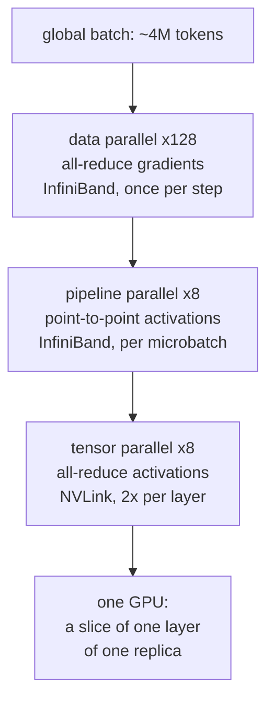

You have now done the same calculation twice without being told it had a name.

In u6 you divided memory bandwidth by bytes-per-decoded-token to get a ceiling
in tokens per second, and you found that attention arithmetic overtakes weight
arithmetic at 8,469 tokens of context. In u7 you divided 153 GB/s by 19 GB to
get 8 tok/s for a dense 35B, then divided by 1.8 GB to get 85 tok/s for the
same model as a mixture of experts, and the entire argument for the
architecture rested on that one division.

Both times you were evaluating the same model of the machine. It has a name,
it is one line long, and once you have it you can predict the performance of
any workload on any accelerator without running it. This unit is that line,
where it comes from in the silicon, and what changes when the workload is a
training run spread across ten thousand chips instead of one laptop generating
one token.

## The machine you are actually running on

An accelerator is not a big CPU. It is a memory system with arithmetic units
attached, and every performance question you will ever ask about it is a
question about the memory system.

Here is the hierarchy on an H100, from fastest and smallest outward:

| level | capacity | bandwidth | latency |
|---|---|---|---|
| registers | ~33 MB total (256 KB per SM x 132 SMs) | ~100 TB/s aggregate | ~1 cycle |
| L1 / shared memory (SRAM) | ~33 MB total (256 KB per SM) | ~30 TB/s aggregate | ~30 cycles |
| L2 cache | 50 MB | ~7 TB/s | ~200 cycles |
| HBM3 (the "80 GB" on the box) | 80 GB | 3.35 TB/s | ~500 cycles |
| NVLink to a peer GPU | - | 900 GB/s | ~2 us |
| InfiniBand to another node | - | 50 GB/s (400 Gb/s) | ~5 us |
| host DRAM over PCIe 5 | - | 64 GB/s | ~10 us |

Read the bandwidth column top to bottom. From SRAM to HBM you lose a factor of
about 9. From HBM to the network you lose another factor of 67. The numbers
that matter in this unit are the HBM row and the two network rows, because
those are the three places where your data has to travel far enough to cost
real time.

The machine on your tray table has the same shape with different constants:
one pool of unified memory shared by the CPU and GPU at **153 GB/s**, backing a
GPU that does on the order of **10 TFLOP/s**. Unified memory removes an entire
class of problem (no host-to-device copies, no "does it fit in VRAM") and
replaces it with a harsher version of the same problem, because 153 GB/s is
what both processors get, together.

### Why moving a byte costs more than using it

This is the fact the whole unit hangs on, and it is a physics fact, not an
engineering one.

Horowitz's widely cited energy figures for a 45nm process put a 32-bit
floating-point add at **0.9 pJ**, a 32-bit multiply at **3.7 pJ**, a 32-bit
read from on-chip SRAM at about **5 pJ**, and a 32-bit read from off-chip DRAM
at about **640 pJ**. Process nodes have shrunk since and the absolute numbers
have all come down, but the *ratios* have gotten worse, not better, because
arithmetic scales with transistor density and off-chip wires do not.

Sit with the ratio. Fetching one operand from DRAM costs roughly **700 times**
the energy of the addition that consumes it, and about **170 times** the energy
of the multiply. On-chip SRAM is about 130x cheaper
than DRAM for the same fetch. A chip designer looking at those numbers concludes
immediately that the only way to go fast is to fetch a value once and then use
it many times, and every architectural feature of a modern accelerator - the
enormous register file, the software-managed shared memory, the tensor cores,
the fused kernels - exists to increase the number of arithmetic operations
performed per byte that crosses the HBM boundary.

<!-- refutes: U10-M2 -->

You probably think GPUs are fast because they have thousands of cores - that
the win is parallelism, that a CPU has 16 lanes and an H100 has 16,896 CUDA
cores, and the ratio is roughly the speedup.

**Here is the prediction that fails.** If core count were the mechanism, then
performance would scale with occupancy, and a kernel running at 100% occupancy
across all 132 SMs would be at or near peak FLOPs. Profile one. A fused
elementwise kernel - a GELU, a residual add, an RMSNorm - saturates every core
on the chip and runs at **under 2% of peak FLOPs**. It is not short of cores.
It is short of bytes. It reads a value, does one or two operations on it, writes
it back, and then waits, and adding cores to that pattern changes nothing at
all. Meanwhile a 4096x4096 matmul uses the same cores and hits 70-80% of peak.
Two kernels, identical hardware, identical occupancy, a 40x difference in
delivered FLOPs. Core count explains none of it.

**Why the belief is appealing.** Core count is the number on the box, and it is
the number that differs most visibly from a CPU. It is also *half* true: the
parallelism is real and necessary. It is necessary specifically as a
latency-hiding mechanism, not as a throughput mechanism. HBM latency is ~500
cycles, and the only way to keep the arithmetic units busy across a 500-cycle
stall is to have thousands of other warps ready to issue. The cores exist to
cover the memory system's latency; they do not exist to beat a CPU at
arithmetic.

**What is actually true.** An accelerator's advantage is bandwidth first and
arithmetic density second. An H100 has roughly 3.35 TB/s of memory bandwidth
against a server CPU's ~0.4 TB/s, and it has dedicated matrix units that
extract far more arithmetic per byte than a general vector unit can. The cores
are the mechanism by which the chip stays busy while the memory system does the
work that actually costs time.

### Tensor cores, and why matmul is the unit of currency

A tensor core is a hardware block that performs a small matrix multiply and
accumulate as a single instruction - on an H100, a tile-level operation like
$D = A B + C$ where the tiles are 16x8x16 or similar, issued once per warp
rather than once per element. It is not a wider SIMD lane. It is a different
shape of instruction:
one issue, one set of operand fetches, many multiply-accumulates.

The delivered difference on an H100:

| unit | precision | peak |
|---|---|---|
| CUDA cores (general vector) | fp32 | 67 TFLOP/s |
| tensor cores | bf16 / fp16 | 989 TFLOP/s |
| tensor cores | fp8 | 1,979 TFLOP/s |

Roughly **15x** for bf16 tensor cores over general fp32 vector math. That factor
is why every architecture decision in this book, going back to u3, expresses
itself as a matrix multiply. Attention is written as $QK^T$ and $PV$ not because
that is the clearest notation but because it is the only formulation the
hardware charges 1/15th price for.

There is a deeper reason matmul is privileged, and it is arithmetic, not
marketing. Multiply two $n \times n$ matrices: the operation costs $2n^3$ FLOPs
and touches $3n^2$ elements. The work grows as the cube of the size and the
data grows as the square, so **the ratio of work to data grows linearly in
$n$**. No other primitive in the network has that property. An elementwise
GELU does one operation per element: the ratio is fixed at approximately 1, at
every size, forever. A softmax, an RMSNorm, a residual add - all fixed-ratio.

Matmul is the only op whose efficiency you can improve by making it bigger.
That is the whole reason the field is built out of matmuls, and it is the
reason the next section's central quantity exists.

```beat
id: u10-b1
type: predict
concept: c-memory-hierarchy
prompt: |
  Two accelerators. You will run one user's decode loop on each: batch size 1,
  a dense 13B model, bf16 weights (2 bytes per parameter).

    Card A:  320 TFLOP/s bf16,  1.6 TB/s HBM
    Card B:  160 TFLOP/s bf16,  2.4 TB/s HBM

  Card A has twice the FLOPs. Before reading on:

  (a) Which card generates tokens faster, and by what ratio?
  (b) How many of Card A's advertised FLOP/s does this workload actually use?
  (c) What single change to the workload - not the hardware - would make Card
      A the better choice?
answer: |
  (a) Card B, by 1.5x. Decode at batch 1 reads all 13B weights from HBM per
  token: 26 GB per token. Card A: 1.6 TB/s / 26 GB = 61.5 tok/s. Card B:
  2.4 / 0.026 = 92.3 tok/s. The ratio is exactly the bandwidth ratio,
  2.4 / 1.6 = 1.5, because the FLOPs term never enters.

  (b) The work is 2 x 13e9 = 26 GFLOP per token at 61.5 tok/s, which is
  1.6 TFLOP/s of 320 - about 0.5%. Card A idles its arithmetic units 99.5% of
  the time.

  (c) Raise the batch size. Weight bytes are read once per forward pass and
  shared across every sequence in the batch, so intensity grows with batch
  while bytes stay fixed. Past a batch size around 200 (Card A's FLOPs/byte
  balance) the workload becomes compute-bound and Card A's 2x arithmetic finally
  buys something.
rubric: |
  Pass requires: (1) Card B, (2) the reason being that decode traffic is
  weight bytes and the ceiling is bandwidth / bytes, (3) part (c) naming batch
  size (or any batching-equivalent: larger batch, speculative decoding,
  processing a prompt rather than generating).
  Answering Card A, or "A for throughput and B for latency", is U10-M1 - the
  spec-sheet comparison - and fails. The FLOPs number is not merely less
  important here; it is not in the cost model at all.
  Getting (a) right by intuition without the division is partial: ask for the
  ratio, since the point is that it equals the bandwidth ratio exactly.
  Answering (c) with "a faster card" or "more memory" misses that the regime,
  not the hardware, is what has to change.
check: llm
```

## Arithmetic intensity and the roofline

Define one quantity.

$$I = \frac{\text{FLOPs performed}}{\text{bytes moved across the HBM boundary}}$$

$I$ is the **arithmetic intensity** of a piece of work, measured in FLOPs per
byte. The denominator is specifically traffic between HBM and the chip - not
traffic between SRAM and registers, which is cheap, and not traffic over the
network, which is a separate budget in the parallelism section. Choosing where
to draw that boundary is the entire skill; put it in the wrong place and every
number that follows is wrong.

Define one property of the hardware.

$$B = \frac{\text{peak FLOP/s}}{\text{peak bytes/s}}$$

$B$ is the **machine balance**, also in FLOPs per byte. It is the intensity a
workload must supply to keep the arithmetic units fed. Below it, the units
starve; above it, the memory system has slack.

| machine | peak FLOP/s | HBM bandwidth | balance $B$ |
|---|---|---|---|
| your laptop's GPU | 10 TFLOP/s | 153 GB/s | **65 FLOP/byte** |
| H100, bf16 | 989 TFLOP/s | 3.35 TB/s | **295 FLOP/byte** |
| H100, fp8 | 1,979 TFLOP/s | 3.35 TB/s | **591 FLOP/byte** |

Now the whole model, which is one line:

$$\boxed{\text{attainable FLOP/s} = \min\left(\text{peak FLOP/s},\ I \times \text{bandwidth}\right)}$$

Plot it with $I$ on the x-axis and attainable FLOP/s on the y-axis, both on log
scales, and you get a line of slope 1 (the bandwidth roof, $I \times$
bandwidth) meeting a horizontal line (the compute roof, peak FLOP/s) at
$I = B$. That corner is the **ridge point**. Every workload is a single point
on the x-axis, and which side of the ridge it falls on decides which of the two
terms is the answer.

- $I < B$: **bandwidth-bound**. Attainable throughput is $I \times$ bandwidth.
  More FLOPs on the spec sheet buy exactly nothing.
- $I > B$: **compute-bound**. Attainable throughput is peak FLOP/s. More
  bandwidth buys exactly nothing.

<!-- refutes: U10-M1 -->

You probably think a faster accelerator makes inference faster, and that
comparing two chips means comparing their TFLOPs. It is how every product page
is written and how every hardware discussion starts.

**Here is the prediction that fails, and you can run it this afternoon.** If
FLOPs set inference speed, then a chip with 2x the FLOPs and the same memory
bandwidth would decode roughly 2x as fast. Benchmark it: single-stream decode
throughput between two such chips is within measurement noise. Meanwhile a chip
with the *same* FLOPs and 1.5x the bandwidth decodes 1.5x faster, to two
significant figures. Single-user token generation tracks the bandwidth column
and ignores the FLOPs column, and it does so with a precision that is almost
insulting to the spec sheet.

**Why the belief is appealing.** FLOPs is the headline number, it is genuinely
the right number for the workloads that made GPUs famous (dense training,
graphics, large-batch serving), and it correlates with price. It is also
correct in the other regime, which is what makes the error survive: the same
person who is wrong about decode is right about training on the same chip.

**What is actually true.** Which number matters is decided by the workload's
arithmetic intensity, not by the hardware. The same H100 is 0.3% efficient on
one kernel and 75% efficient on the next. "Fast hardware" is not a property of
hardware. It is a property of a (hardware, workload) pair, and the roofline is
the function that maps the pair to an answer.

### The procedure, worked in both regimes

<!-- fade: roofline -->

Five steps. They never change.

1. Count the FLOPs the work requires.
2. Count the bytes that must cross the HBM boundary.
3. Divide: $I = \text{FLOPs} / \text{bytes}$.
4. Compare $I$ to the machine balance $B$ to name the regime.
5. Compute the ceiling from the binding term, and convert it to whatever unit
   the question was actually asked in.

**Regime one: decode at batch 1, on your laptop.** This is the u7 calculation,
re-derived as an instance of the general law.

The work is a sequence of matrix-vector products. Take one weight matrix $W$ of
shape $m \times n$ ($m$ output features, $n$ input features) and the activation
vector $x \in \mathbb{R}^{n}$ for the single token being generated. Let $b$ be
the bytes per stored weight; at 4.35 bits, $b = 4.35/8 = 0.544$ bytes.

*Step 1, FLOPs.* Each of the $mn$ weights participates in one multiply and one
add: $2mn$ FLOPs.

*Step 2, bytes.* Every weight is read from HBM exactly once: $mn \cdot b$ bytes.
The activation vectors are $n$ and $m$ elements, negligible against $mn$.

*Step 3, intensity.*

$$I = \frac{2mn}{mn \cdot b} = \frac{2}{b} = \frac{2}{0.544} = 3.68 \text{ FLOP/byte}$$

Notice that $m$ and $n$ cancelled. The shape of the matrix is irrelevant. At
batch 1, every matrix-vector product in the network has intensity $2/b$,
always.

*Step 4, regime.* $I = 3.68$ against $B = 65$. You are short by a factor of
17.8. **Bandwidth-bound**, and not marginally.

*Step 5, ceiling.*

$$\text{attainable} = I \times \text{bandwidth} = 3.68 \times 153 \times 10^{9} = 563 \text{ GFLOP/s}$$

That is 5.6% of the GPU's 10 TFLOP/s. To convert into tokens per second, divide
by the FLOPs one token requires. The book's teacher model activates 3.3B
parameters per token, so one token costs $2 \times 3.3 \times 10^{9} = 6.6$
GFLOP:

$$\frac{563 \times 10^{9}}{6.6 \times 10^{9}} = 85 \text{ tok/s}$$

Which is exactly u7's answer, reached by a different route. u7 divided
bandwidth by bytes-read-per-token: $153 / 1.8 = 85$. Here we divided
bandwidth-limited FLOP/s by FLOPs-per-token. The two agree because in the
bandwidth-bound regime the FLOPs cancel out of the answer entirely - which is
the formal statement of "compute does not matter here."

**Regime two: the same weights, batched.** Change one thing. Instead of one
token, push $B_{\text{tok}}$ token positions through the same weight matrix at
once - a batch of users, or a prefill over a prompt, or a training microbatch.
$W$ is now multiplied by $X$ of shape $n \times B_{\text{tok}}$.

*Step 1, FLOPs.* $2mnB_{\text{tok}}$. Linear in the batch.

*Step 2, bytes.* Still $mn \cdot b$. **Unchanged.** The weights are read once
and reused across every column of $X$.

*Step 3, intensity.*

$$I = \frac{2mnB_{\text{tok}}}{mn \cdot b} = \frac{2B_{\text{tok}}}{b}$$

*Step 4, regime.* Take an H100 with bf16 weights, so $b = 2$ and
$I = B_{\text{tok}}$ exactly - the intensity in FLOP/byte and the batch size in
tokens are the same number. The machine balance is 295. So:

$$B_{\text{tok}}^{*} = 295 \text{ tokens}$$

Below 295 positions per forward pass you are bandwidth-bound; above it you are
compute-bound. That single number explains an enormous amount of serving
behavior. It is why batch 1 decode on an H100 runs at $1 \times 3.35 =
3.35$ TFLOP/s, **0.34% of the chip's 989**. It is why serving stacks fight so
hard for large batches. And it is why prefill over a 2,000-token prompt
($I = 2000$, seven times past the ridge) runs at essentially peak while decode
of the reply runs at a third of a percent of it - the observation you already
made in u6, now with a number attached to the crossover.

```beat
id: u10-b2
type: compute
concept: c-roofline
prompt: |
  H100: 989 TFLOP/s peak bf16, 3.35 TB/s of HBM bandwidth.

  Workload: a batched decode step, 32 sequences advanced by one token each in
  a single forward pass. Weights are bf16, so 2 bytes per parameter. Weight
  bytes are read once per forward pass and reused across all 32 positions;
  activation traffic is negligible.

  Arithmetic intensity for a weight matmul under these conditions is
  2 * (positions per pass) / (bytes per weight).

  Give the attainable throughput in TFLOP/s. Bare number, one decimal place.
answer: 107.2
rubric: |
  Expected work: I = 2 * 32 / 2 = 32 FLOP/byte. Machine balance is
  989 / 3.35 = 295 FLOP/byte, so 32 < 295 and the workload is bandwidth-bound.
  Attainable = I * bandwidth = 32 * 3.35e12 = 1.072e14 = 107.2 TFLOP/s.
  Diagnostic wrong answers: 989 means the learner took peak and never computed
  the intensity (U10-M1, the spec-sheet answer); 53.6 means they dropped the
  factor of 2 for multiply-and-add; 3.35 means they used batch 1; 31,648 means
  they multiplied intensity by peak FLOP/s instead of by bandwidth (a units
  slip - only I * bandwidth has units of FLOP/s, check it).
check: numeric(0.001)
```

```beat
id: u10-b3
type: completion
concept: c-roofline
prompt: |
  Run the five-step roofline procedure on a workload you have not seen. Fill
  in every blank.

    Hardware:  peak 400 TFLOP/s bf16,  HBM bandwidth 2.0 TB/s
    Workload:  one forward pass over a dense 20B-parameter model, bf16 weights
               (2 bytes each), with 8 token positions in the pass

    Step 1 - FLOPs required:
        2 * (parameters) * (positions) = 2 * 20e9 * 8 = ____(a)____ FLOPs

    Step 2 - bytes across the HBM boundary:
        (parameters) * (bytes per weight) = 20e9 * 2 = 40e9 bytes
        (read once per pass, reused across all 8 positions)

    Step 3 - arithmetic intensity:
        I = ____(a)____ / 40e9 = ____(b)____ FLOP/byte

    Step 4 - machine balance and regime:
        B = 400e12 / 2.0e12 = ____(c)____ FLOP/byte
        Since I ____ B, the workload is ____(d)____-bound

    Step 5 - ceiling:
        attainable = ____(e)____ FLOP/s
        tokens per second = attainable / (FLOPs per token) = ____(f)____ tok/s

    Step 6 - one sentence: the vendor releases a new card with the same 2.0 TB/s
    and 800 TFLOP/s. State the new tokens-per-second figure and why.
        ____(g)____
answer: |
  (a) 2 * 20e9 * 8 = 3.2e11 FLOPs
  (b) 3.2e11 / 40e9 = 8 FLOP/byte
  (c) 400e12 / 2.0e12 = 200 FLOP/byte
  (d) I = 8 is far below B = 200, so the workload is bandwidth-bound
  (e) attainable = I * bandwidth = 8 * 2.0e12 = 1.6e13 = 16 TFLOP/s
      (equivalently: 40e9 bytes / 2.0e12 B/s = 0.02 s per pass, 3.2e11 FLOPs
      in 0.02 s = 1.6e13 FLOP/s)
  (f) FLOPs per token = 2 * 20e9 = 4e10. So 1.6e13 / 4e10 = 400 tok/s
      aggregate across the 8 sequences, i.e. 50 tok/s each.
  (g) Unchanged at 400 tok/s. Doubling peak FLOP/s moves the compute roof and
      the ridge point (B becomes 400 FLOP/byte), but the workload sits at
      I = 8, on the bandwidth roof, and the bandwidth roof did not move. The
      only levers are more bandwidth or higher intensity.
rubric: |
  (a) 3.2e11 exact. (b) 8 exact. (c) 200 exact. (e) 16 TFLOP/s (+/- 0.2).
  (f) 400 tok/s aggregate (+/- 5); accepting 50 tok/s per sequence with the
  aggregate shown is equally correct.
  (d) and (g) carry the concept and must both be right to pass. (d) must name
  bandwidth-bound with the comparison stated, not asserted. (g) must say the
  figure does not change AND give the reason in roofline terms - the workload
  is on the bandwidth roof and only the compute roof moved.
  Answering (g) with "800 tok/s" or "twice as fast" is U10-M1 and is an
  automatic fail regardless of (a)-(f), because it is the exact error the
  procedure exists to prevent.
  Pass = (d) and (g) correct AND at least three of (a), (b), (c), (e), (f).
# variant blanking: blank (a) and (e) in one variant, (c) and (f) in another.
# (d) and (g) should be blank in every variant - naming the regime and knowing
# which roof a change moves are the two transferable skills.
check: llm
```

Two corollaries worth carrying out of this section.

**Elementwise operations are always bandwidth-bound.** A GELU reads a value and
writes a value: 4 bytes of bf16 traffic for one or two FLOPs, so $I \approx
0.5$. Against a balance of 295 that is a factor of 590 short. There is no batch
size, no chip, and no compiler that fixes this, because the ratio has no free
parameter in it. The only available move is to stop crossing the HBM boundary
between operations - fuse the GELU into the matmul kernel that produced its
input so the value never leaves SRAM. That is what "kernel fusion" means and it
is why every serious inference stack is largely a collection of fused kernels.

**Matmul is the only op that gets more efficient as it grows.** For a square
$n \times n \times n$ bf16 matmul, $I = 2n^3 / (3n^2 \cdot 2) = n/3$. Setting
$n/3 = 295$ gives $n \approx 886$: square bf16 matmuls smaller than about 886
on a side are bandwidth-bound on an H100 even though they are matmuls. This is
why small models do not run efficiently on big chips, and why the phrase "the
matmuls are too small" is a complete performance diagnosis.

## FlashAttention: changing the bytes, not the FLOPs

Attention is the workload where the roofline stops being a description and
becomes an instruction.

Recall the computation from u3, for one head, one layer, sequence length $n$,
head width $d$:

$$S = QK^{T} \in \mathbb{R}^{n \times n}, \qquad P = \text{softmax}(S), \qquad O = PV \in \mathbb{R}^{n \times d}$$

where $Q, K, V \in \mathbb{R}^{n \times d}$ are the query, key, and value
matrices and $S_{ij}$ is the score of query $i$ against key $j$.

The textbook implementation does exactly what the equations say: compute $S$,
store it, softmax it, store $P$, multiply by $V$. The problem is the word
"store". $S$ has $n^2$ entries.

```beat
id: u10-b4
type: compute
concept: c-memory-hierarchy
prompt: |
  One attention head, one layer. Sequence length n = 8192, head width d = 128,
  fp16 throughout (2 bytes per element).

  A textbook attention implementation materializes the full score matrix
  S = QK^T, of shape n x n, in HBM.

  How many bytes is that single matrix? Give the exact integer, no units, no
  separators.
answer: 134217728
rubric: |
  Expected work: 8192 * 8192 * 2 = 134,217,728 bytes = 128 MiB.
  Graded exactly - this is an integer, not an estimate.
  Diagnostic wrong answers: 67108864 means they used 1 byte per element or
  forgot that fp16 is 2 bytes; 2097152 is the size of Q alone (n * d * 2),
  which means they sized the inputs rather than the score matrix - the whole
  point is that the intermediate is 64x larger than any of its operands;
  16777216 means they counted n * n elements and forgot the 2 bytes each.
  Context for feedback: the H100's entire on-chip SRAM is about 33 MB, so this
  one matrix, for one head of one layer, is roughly 4x larger than all the
  fast memory on the chip.
check: exact
```

128 MiB, for one head of one layer, against roughly 33 MB of SRAM on the entire
chip. It cannot stay on-chip, so it goes to HBM, and then comes back, and then
the softmax output goes out and comes back. Count the traffic for one head:

| tensor | bytes |
|---|---|
| $Q$, $K$, $V$, $O$ (4 tensors, $n \times d$) | 8 MiB total |
| write $S$ | 128 MiB |
| read $S$ for softmax | 128 MiB |
| write $P$ | 128 MiB |
| read $P$ for $PV$ | 128 MiB |
| **total** | **520 MiB** |

The arithmetic is $2n^2d$ for $QK^T$ plus $2n^2d$ for $PV$, so $4n^2d =
4 \times 8192^2 \times 128 = 34.36$ GFLOP. Run the procedure:

$$I_{\text{textbook}} = \frac{34.36 \times 10^{9}}{545 \times 10^{6}} = 63 \text{ FLOP/byte}$$

Against $B = 295$: **bandwidth-bound**, by a factor of 4.7. An operation built
entirely out of matrix multiplies, running at a fifth of the chip's capability,
because of an intermediate that nobody wanted.

**FlashAttention's move is to never write $S$ at all.** Split $Q$ into blocks of
rows and $K, V$ into blocks of rows, sized so that a $Q$ block, a $K$ block, a
$V$ block, and the corresponding tile of $S$ all fit in one SM's SRAM together.
For each $Q$ block, loop over the $K$/$V$ blocks: compute the score tile in
SRAM, update a running softmax, accumulate into the output block, discard the
tile. The $n \times n$ matrix is produced a tile at a time and never exists in
HBM.

The hard part is the softmax, because softmax needs a denominator over the
whole row and you are only holding a tile of it. The fix is the online
(streaming) softmax: carry a running maximum $m$ and a running sum $\ell$ per
row, and when a new tile arrives with a larger maximum $m'$, rescale the
accumulated output and sum by $e^{m - m'}$ before adding the new contribution.
The rescaling makes the streaming result **bit-comparable to the batch
computation** - this is an exact algorithm, not an approximation. (The
derivation is in the deeper-math treatment of this section.)

The new traffic is $Q$, $K$, $V$, $O$ - 8 MiB - plus re-reads of $K$ and $V$
blocks across $Q$ blocks, which a well-chosen tiling keeps to a small constant.
Take the ideal case:

$$I_{\text{flash}} = \frac{34.36 \times 10^{9}}{8.39 \times 10^{6}} = 4096 \text{ FLOP/byte}$$

which is $n/b$ - the intensity grows linearly with sequence length, because the
FLOPs grow as $n^2$ and the traffic grows as $n$. Against $B = 295$, that is
**compute-bound by a factor of 14**.

Same FLOPs. Same output, to the last bit. **65x less HBM traffic**, and a
workload that moved from the bandwidth roof to the compute roof. That is the
canonical result of IO-aware algorithm design, and it is what the roofline is
*for*: the model does not merely tell you that attention was slow, it tells you
that the fix has to be in the denominator.

```beat
id: u10-b5
type: self-explain
concept: c-memory-hierarchy
prompt: |
  A colleague swaps a textbook attention kernel for FlashAttention and measures
  a 4x end-to-end speedup on a long-context benchmark. They write in the PR
  description: "FlashAttention is a faster attention algorithm - it does less
  work."

  In your own words: (a) say precisely what is wrong with that sentence,
  (b) explain what actually changed, in roofline terms, and (c) explain why
  the speedup was 4x and not, say, 65x, given that HBM traffic dropped by
  about 65x.
answer: |
  (a) It does not do less work. FLOP counts are identical - the same 4 n^2 d
  multiply-accumulates for QK^T and PV, and the same output values to the last
  bit, since the online softmax rescaling is exact rather than approximate.
  What changed is not the numerator.

  (b) The denominator. The textbook version materializes the n x n score
  matrix in HBM and reads it back, twice over, which for n = 8192 is 512 MiB of
  traffic against 8 MiB of unavoidable Q/K/V/O traffic. That puts arithmetic
  intensity at roughly 63 FLOP/byte, well below the H100's balance of 295, so
  attention runs on the bandwidth roof at about a fifth of peak. Tiling into
  SRAM removes the intermediate entirely, raising intensity to order n/b, which
  crosses the ridge point and puts the same arithmetic on the compute roof.

  (c) Because once you cross the ridge, further traffic reduction buys nothing -
  the compute roof is flat. Attention was running at roughly 63/295 = 21% of
  peak and can rise to at most 100%, which caps the attention speedup near 4.7x.
  Cutting traffic by 65x when only 4.7x of it was binding wastes the surplus.
  On top of that, attention is only part of the forward pass; the weight
  matmuls did not change at all, so Amdahl caps the end-to-end number below
  even the kernel-level one.
rubric: |
  Must contain all three: (1) FLOPs are unchanged and the output is exact, so
  "less work" is wrong; (2) the change is HBM traffic / arithmetic intensity,
  stated as a move from the bandwidth roof to the compute roof; (3) the
  speedup saturates at the compute roof - traffic reduction past the ridge
  point buys nothing, so 65x less traffic cannot produce 65x more speed.
  Pass = all three in the learner's own phrasing.
  Partial = (1) and (2) present, (3) answered only as "Amdahl / attention is
  part of the model". That is true but secondary; the roofline saturation
  argument is the one this section teaches, so probe for it.
  Fail patterns to name:
  - "it approximates the softmax to save memory" - this is the most common
    wrong belief about FlashAttention and it is false; the algorithm is exact.
    Correct it directly with the rescaling-by-e^(m-m') mechanism.
  - "it reduces attention from O(n^2) to O(n)" - conflates memory traffic with
    compute complexity. Compute is still O(n^2 d); it is HBM traffic that drops
    to O(n d). This is M10 in a new costume - flag it.
  - answers that credit "better parallelism" or "more cores used" are U10-M2.
check: llm
```

### The same lens on the KV cache

One more application, because it re-reads a result from u6 in a way that makes
a design decision obvious.

At decode step $n$, attention over the cache reads every cached key and value
and does a dot product and a weighted sum with each. Per token of context, using
u6's formulas: $4 \cdot d_{head} \cdot H_q \cdot L$ FLOPs against
$2 \cdot L \cdot H_{kv} \cdot d_{head} \cdot b$ bytes, where $H_q$ is the number
of query heads, $H_{kv}$ the number of key/value heads, $d_{head}$ the head
width, $L$ the layer count, and $b$ the bytes per cached scalar. Divide:

$$I_{\text{attn-decode}} = \frac{4 \cdot d_{head} \cdot H_q \cdot L}{2 \cdot L \cdot H_{kv} \cdot d_{head} \cdot b} = \frac{2 H_q}{H_{kv} \cdot b}$$

$d_{head}$ cancels, $L$ cancels, $n$ cancels. What survives is the **grouped-query
ratio** $H_q / H_{kv}$ and the cache precision.

For plain multi-head attention, $H_q = H_{kv}$ and $I = 2/b = 1$ FLOP/byte in
fp16 - the worst intensity in the entire network, below even the 4-bit weight
matvecs at $2/0.544 = 3.7$. Under u6's grouped-query configuration,
$H_q/H_{kv} = 32/4 = 8$, so $I = 8$ FLOP/byte: eight query heads share one set
of cached keys, and each cached byte gets used eight times instead of once.

So GQA is not only the memory-capacity optimization u6 presented. It is
simultaneously an **arithmetic-intensity** optimization, and the group size is
the reuse factor exactly. Two apparently different benefits, one mechanism,
visible only once you have the roofline.

```beat
id: u10-b6
type: compute
concept: c-roofline
prompt: |
  Attention over the KV cache during decode, for a model with 64 query heads
  and 8 key/value heads (grouped-query attention), head width 128, 80 layers,
  KV cache stored in fp16 (2 bytes per scalar).

  Per token of context per layer, the arithmetic is
      4 * d_head * H_q  FLOPs
  and the cache traffic is
      2 * H_kv * d_head * b  bytes.

  Give the arithmetic intensity in FLOP/byte. Bare number, one decimal place.
answer: 8.0
rubric: |
  Expected work: FLOPs = 4 * 128 * 64 = 32768; bytes = 2 * 8 * 128 * 2 = 4096;
  32768 / 4096 = 8.0. Equivalently 2 * H_q / (H_kv * b) = 2 * 64 / 16 = 8.
  Diagnostic wrong answers: 1.0 means the learner used H_kv in the numerator
  as well, i.e. computed the multi-head case and missed that GQA is what
  creates the reuse; 4.0 means they dropped the factor of 2 from
  multiply-and-add, or used b = 4; 16.0 means they used b = 1 (fp8 cache, which
  is a different and real configuration but not the one asked); 64.0 means they
  used the head-count ratio alone without the 2/b factor.
  Note for feedback: d_head and the layer count cancel, so a learner who
  carried them through and still got 8.0 has done more arithmetic than
  necessary but understands the structure.
check: numeric(0.005)
```

## Why training and inference want different iron

<!-- refutes: U10-M3 -->

You probably think that a good chip for training is a good chip for inference -
that it is all the same matmuls on the same weights, so the ranking of hardware
should be roughly the same for both.

**Here is the prediction that fails.** If the workloads had the same shape,
then the hardware that wins at training would win at single-user inference, and
a chip designed for one would be a reasonable buy for the other. Instead, the
market has split in half. Groq sells inference parts whose selling point is
enormous **SRAM** capacity and almost no HBM, and they beat H100s badly at
low-batch decode while being useless for training. Apple silicon serves 35B
models on a laptop at conversational speed with 1% of an H100's FLOPs. And
the H100 itself, the training part, spends 99.7% of its arithmetic idle when
asked to decode one stream. Three products, three different optimal points, one
apparently identical set of matmuls.

**Why the belief is appealing.** The *operations* really are the same. The
forward pass in training is bit-for-bit the same computation as a prefill. The
weights are the same tensors. Nothing in the mathematics distinguishes them.

**What is actually true.** Two things differ, and both of them move the
workload across the ridge point.

**Difference one: batch, therefore regime.** Training runs at millions of
tokens per optimizer step, spread across the cluster as microbatches of
thousands of positions each. Intensity is $2B_{\text{tok}}/b$, and at
$B_{\text{tok}} = 4096$ with bf16 weights that is 4,096 FLOP/byte against a
balance of 295 - **fourteen times past the ridge, solidly compute-bound.**
Single-user decode is $B_{\text{tok}} = 1$, intensity 1 FLOP/byte, **295 times
short of the ridge.** These are not two settings of one workload. They are
opposite sides of the model, and the hardware that is correct for one is
provably not correct for the other.

**Difference two: memory, by a factor of eight.** Inference needs the weights
and the KV cache. Training needs the weights, the gradients, the optimizer
state, and the saved activations. Count bytes per parameter for standard
mixed-precision AdamW:

| tensor | precision | bytes/param |
|---|---|---|
| weights | bf16 | 2 |
| gradients | bf16 | 2 |
| master weights | fp32 | 4 |
| Adam first moment $m$ | fp32 | 4 |
| Adam second moment $v$ | fp32 | 4 |
| **total** | | **16** |

For a 70B model that is $16 \times 70 \times 10^{9} = 1.12$ TB of state, before
a single activation is saved. On 80 GB H100s, that state alone requires
**fourteen GPUs** - which is to say, a 70B model cannot be trained on
any single accelerator that exists, at any price, and the parallelism section
below is not an optimization but a precondition. The same model serves
inference in 140 GB at bf16, or 38 GB at 4.35 bits: **8x to 29x less memory**
for the same weights.

Put the two machines side by side on the workloads they are each built for:

| | your laptop | H100 |
|---|---|---|
| bandwidth | 153 GB/s | 3.35 TB/s (22x) |
| peak bf16 | ~10 TFLOP/s | 989 TFLOP/s (99x) |
| balance | 65 FLOP/byte | 295 FLOP/byte |
| memory | unified, CPU+GPU shared | 80 GB HBM, device-only |
| batch-1 decode ceiling, 4-bit 35B-A3B | 85 tok/s | ~1,860 tok/s |
| useful for a 70B training run | no | only in groups of thousands |

Look at the second and third rows together. The H100 has 22x the bandwidth and
99x the FLOPs, so its balance point is 4.5x higher, which means it is 4.5x
*harder to feed*. The bigger machine is the one that is more sensitive to low
arithmetic intensity, not less. A laptop is a surprisingly reasonable batch-1
decode machine for exactly this reason, and a terrible training machine for the
same one.

## Four ways to split a model, and what each one stresses

A 70B training run needs 1.12 TB of optimizer state, so it does not fit on one
device, so it is a distributed system. Everything you know about distributed
systems applies, and the vocabulary maps cleanly: this is sharding, the
collective operations are the primitives, the interconnect is the network you
are always fighting, and stragglers are your problem.

<!-- refutes: U10-M5 -->

One thing does not map, and it is worth flagging before the details. You
probably expect that splitting a model across $N$ devices gives you $N$ times
the memory and roughly $N$ times the throughput, and that *which* axis you split
along is an implementation detail - the way a shard key mostly affects hot spots
rather than throughput. The prediction that fails: tensor parallelism at degree
8 would then cost the same inside one node and across eight nodes, since the
bytes communicated are identical. It does not. The same configuration runs 18x
slower purely from placement, and flat data parallelism at 8,192-way spends ten
times as long communicating as computing with no bug anywhere. Each axis carries
a *different collective at a different frequency*, and the arrangement is a
design problem with one rule: the most frequent collective gets the fastest
link. The rest of this section is that rule, derived.

There are four axes you can split along. Real runs use all of them at once.

### Data parallelism: replicate the model, shard the batch

Every device holds a complete copy of the weights. The global batch is split
across devices; each computes gradients on its shard; then all devices
**all-reduce** the gradients so every replica applies the identical update.

The all-reduce is the whole story. A ring all-reduce over $P$ devices requires
each device to push $2(P-1)/P \cdot S$ bytes, where $S$ is the gradient buffer
size - a reduce-scatter phase and an all-gather phase, each moving
$(P-1)/P \cdot S$. For large $P$ that is essentially $2S$, independent of $P$,
which is the property that makes ring all-reduce the standard choice.

```beat
id: u10-b7
type: compute
concept: c-parallelism
prompt: |
  Pure data parallelism over a 70B-parameter model, gradients in bf16
  (2 bytes per parameter), 8,192 GPUs.

  A ring all-reduce requires each device to push 2 * (P-1)/P * S bytes, where
  S is the gradient buffer size. With P = 8192 take (P-1)/P = 1, so each device
  pushes 2S.

  Each device has one 400 Gb/s InfiniBand link, which is 50 GB/s.

  How many seconds does the gradient all-reduce take per optimizer step?
  Bare number, one decimal place.
answer: 5.6
rubric: |
  Expected work: S = 70e9 * 2 = 140 GB. Each device pushes 2S = 280 GB.
  280 / 50 = 5.6 seconds.
  Diagnostic wrong answers: 2.8 means they dropped the factor of 2 and charged
  only one phase of the ring - the reduce-scatter and the all-gather each move
  the full buffer; 0.31 means they used NVLink bandwidth (900 GB/s), which is
  the right number for an intra-node reduce and the wrong one for a
  cluster-wide one - the distinction is the entire point of this section;
  0.7 means they read 400 Gb/s as 400 GB/s and skipped the divide-by-8;
  45,875 means they multiplied the per-device volume by P = 8,192, which is
  exactly the property ring all-reduce does not have - per-device bytes are
  independent of P; 22,937 is that same error with the factor of 2 also
  dropped.
  Context for feedback: the compute in that same step is roughly 0.54 seconds
  per device, so this configuration spends ten times as long communicating as
  computing. It is a demonstration that flat data parallelism at this scale
  does not work, not a recommendation.
check: numeric(0.005)
```

That 5.6 seconds is the punchline. Compute per device per step, at a 4M-token
global batch spread over 8,192 GPUs, is 512 tokens per device, or
$6 \times 70 \times 10^{9} \times 512 = 2.15 \times 10^{14}$ FLOPs, which at
40% of an H100's peak takes **0.54 seconds**. Ten times as long
communicating as computing. Flat data parallelism at 8,192-way does not work.

Three things fix it, and all three are in every real training stack:

- **Overlap.** Gradients for layer $\ell$ are ready while layer $\ell-1$ is
  still in its backward pass, so the all-reduce for the later layers starts
  immediately and runs underneath the remaining compute. This is bucketed
  gradient reduction, and it is why frameworks fuse gradients into buckets of a
  few tens of MB.
- **Fewer replicas.** Combine with the axes below so that the data-parallel
  degree is 128 rather than 8,192, and each replica owns 1/64 of the parameters.
  The buffer per device drops to 140/64 = 2.19 GB, the all-reduce moves 4.4 GB,
  and the time falls to 0.088 seconds. This is the real reason 3D parallelism
  exists.
- **Gradient accumulation.** Run several microbatches and sum their gradients
  locally before communicating, which amortizes one all-reduce over $k$ times
  as much compute. More on this below, since it is routinely confused with a
  different technique that has the opposite tradeoff.

Data parallelism also has a memory problem: every replica stores the full
16 bytes/param of state. ZeRO / FSDP shards the optimizer state, gradients, and
optionally the weights across the data-parallel group, gathering each layer's
weights just before use and releasing them after - trading extra all-gather
traffic for a factor-of-$P$ reduction in state memory. It is the same
capacity-for-bandwidth trade MoE makes in u7, pointed at a different resource.

### Tensor parallelism: split each matmul

Cut the individual weight matrices. For an MLP block with weights $W_1$ (up
projection) and $W_2$ (down projection), split $W_1$ by columns and $W_2$ by
rows across $t$ devices. Each device computes a partial result over its slice;
the partial outputs are summed with an **all-reduce**, and only then does the
block's output exist. Attention splits by head: each device owns a subset of the
heads, and the output projection needs the same all-reduce.

The cost is two all-reduces per transformer layer, of the activation tensor -
not the weights, so it scales with tokens-in-flight rather than parameters.
Concretely, with $d_{model} = 8192$, a microbatch of 8,192 token positions, and
bf16 activations, each all-reduce moves $8192 \times 8192 \times 2 = 128$ MiB,
and 80 layers at two per layer with the ring factor of 2 comes to **40 GiB per
forward pass**:

- over NVLink at 900 GB/s: **48 ms**
- over InfiniBand at 50 GB/s: **859 ms**

Eighteen times worse, per pass, forever. This is why tensor parallelism stops
at the node boundary. TP degree 8 inside an NVLink-connected node is standard;
TP across nodes is a configuration people try once.

### Pipeline parallelism: split by layer

Assign layers 1-10 to device 1, 11-20 to device 2, and so on. Activations flow
forward device to device and gradients flow back - point-to-point sends of one
activation tensor per boundary, which is by far the cheapest communication
pattern of the four.

The cost is not bandwidth, it is idleness. With $p$ pipeline stages, the first
stage finishes its work and waits for the last stage to finish before the
backward pass can reach it. Split the batch into $m$ microbatches and pipeline
them, and the fraction of time each device spends idle - the **bubble** - is

$$\text{bubble fraction} = \frac{p - 1}{m + p - 1}$$

For $p = 8$ stages: at $m = 8$ microbatches the bubble is $7/15 = 47\%$ - you
are wasting nearly half the cluster. At $m = 64$ it is $7/71 = 9.9\%$. The
lesson is that pipeline parallelism is only viable with many microbatches per
step, which forces a large global batch, which interacts with the learning-rate
schedule. Interleaved and zero-bubble schedules improve on this at the cost of
more communication and considerably more complexity.

### Expert parallelism: shard the experts

For the MoE models of u7, put different experts on different devices. Each
token's residual vector must travel to whichever devices host its selected
experts and the results must come back: an **all-to-all** collective, twice per
MoE layer.

All-to-all is the least forgiving collective. Every device talks to every other
device, the message sizes are data-dependent (they depend on how the router
happened to distribute this batch), and the whole layer waits for the slowest
pair. This is the concrete reason u7's capacity factor exists: fixed per-expert
slot budgets, with overflow tokens dropped, because a fixed-shape all-to-all is
schedulable and a variable-shape one is not.

### Composing them

A frontier run uses all of these simultaneously, in a nested arrangement chosen
so that each collective lands on an interconnect that can carry it:



$128 \times 8 \times 8 = 8{,}192$ GPUs. Read the diagram by communication
frequency, because that is what determines placement: tensor parallelism
communicates twice per layer, so it gets the fastest link and stays inside one
node. Pipeline parallelism communicates once per stage boundary. Data
parallelism communicates once per optimizer step, so it can tolerate the
slowest link in the building. The hierarchy of parallelism strategies is
exactly the hierarchy of interconnect bandwidths, matched term for term. Add
expert parallelism for an MoE and you have the "4D" arrangement.

## Precision: range is the scarce resource, not resolution

<!-- refutes: U10-M4 -->

You probably think that training in 16-bit instead of 32-bit halves the
model's accuracy, or at least costs something proportional to the bits given
up - that precision is a dial trading quality for speed.

**Here is the prediction that fails.** If halving the bit width halved the
quality, then bf16 training would produce measurably worse models than fp32
training. It does not. Matched-hyperparameter comparisons put bf16 and fp32
final loss within noise of each other, and every frontier model of the last
five years was trained in 16-bit or less. Sharper still: **fp16 and bf16 have
the same bit count and behave completely differently**, with fp16 diverging on
runs where bf16 is stable. A single "number of bits" cannot explain a
difference between two 16-bit formats, so the bit count is not the variable
that matters.

**Why it is appealing.** The bit-counting intuition is the same one M16
attacked for quantization, and it is correct in domains where engineers first
meet it - image and audio compression, fixed-point DSP. It is also reinforced
by the fact that reduced precision genuinely does break things, just not in the
way the intuition predicts.

**What is actually true.** A floating-point format spends its bits on two
separate things, and training cares almost exclusively about one of them.

| format | sign | exponent | mantissa | max value | min normal | relative resolution |
|---|---|---|---|---|---|---|
| fp32 | 1 | 8 | 23 | $3.4 \times 10^{38}$ | $1.2 \times 10^{-38}$ | $2^{-24} = 6 \times 10^{-8}$ |
| bf16 | 1 | **8** | 7 | $3.4 \times 10^{38}$ | $1.2 \times 10^{-38}$ | $2^{-8} = 0.4\%$ |
| fp16 | 1 | **5** | 10 | $65{,}504$ | $6.1 \times 10^{-5}$ | $2^{-11} = 0.05\%$ |

bf16 is fp32 with sixteen mantissa bits deleted: identical exponent field,
identical range, and resolution coarser by a factor of $2^{16} = 65{,}536$
($2^{-8}$ against fp32's $2^{-24}$). fp16 spends three of its
exponent bits on mantissa instead: eight times *finer* resolution than bf16,
and a dynamic range that tops out at 65,504 and bottoms out at $6.1 \times
10^{-5}$ for normal values.

Now ask what a gradient looks like. Deep in a transformer stack, individual
weight gradients of $10^{-8}$ are unremarkable.

- In bf16: $10^{-8}$ is nowhere near the $1.2 \times 10^{-38}$ floor. Stored
  with 0.4% relative error. Fine.
- In fp16: $10^{-8}$ is below the smallest subnormal, $5.96 \times 10^{-8}$.
  It rounds to **exactly zero**. The gradient does not exist. The weight never
  updates.

That is the mechanism. Not "less accurate" - *absent*. And it explains the
historical sequence: fp16 training required **loss scaling**, where you multiply
the loss by a constant $S$ (commonly $2^{16} = 65{,}536$) before the backward
pass so every gradient is scaled up by $S$ into fp16's representable range,
then divide by $S$ before the optimizer step. Our $10^{-8}$ gradient becomes
$6.6 \times 10^{-4}$, comfortably normal. Dynamic loss scaling adjusts $S$ up
until something overflows, then backs off - an entire control loop whose only
purpose is to keep gradients inside a five-bit exponent. bf16 deleted the
problem by having fp32's exponent, which is why it took over as soon as
hardware supported it.

```beat
id: u10-b8
type: predict
concept: c-precision-scale
prompt: |
  A training run in fp16 with loss scaling is being ported to bf16. Both are
  16-bit formats. The team makes two changes: they switch the storage format,
  and they delete the dynamic loss scaler and its overflow-detection logic.

  Predict, before reading on:
  (a) Why is deleting the loss scaler safe in bf16 when it was mandatory in
      fp16? Be specific about which field of the format changed.
  (b) bf16 has three fewer mantissa bits than fp16 - eight times coarser
      resolution. Name the one place in the training loop where that coarseness
      does bite, and what the standard fix is.
  (c) The team also considers storing the AdamW moment estimates in bf16 to
      save memory. Predict what happens.
answer: |
  (a) The exponent field. fp16 has 5 exponent bits, giving a smallest normal
  value of 6.1e-5 and a smallest subnormal of 6.0e-8; gradients below that
  flush to zero, so loss scaling exists purely to shift gradients up into
  representable range. bf16 has 8 exponent bits - the same as fp32 - so its
  floor is 1.2e-38 and no realistic gradient underflows. The mantissa loss is
  irrelevant to that failure; range was always the binding constraint.

  (b) The weight update. bf16's relative resolution is 2^-8, about 0.4%, so the
  spacing of representable values just below 1.0 is 0.0039. A per-step update
  of relative size 1e-4 - entirely typical - is more than an order of magnitude
  below half a step, so w + dw rounds straight back to w and the update is lost
  completely. The standard fix is fp32 master weights: the optimizer keeps an
  fp32 copy of every parameter, applies updates to that, and casts down to bf16
  for the forward and backward passes. This is why mixed-precision training
  costs 16 bytes per parameter rather than 4.

  (c) It degrades or destroys the run, for the same reason as (b) plus one
  more. Adam's second moment v accumulates squared gradients: squaring a 1e-8
  gradient gives 1e-16, which bf16 represents fine on range but with 0.4%
  error, and the epsilon-regularized division amplifies error in the small-v
  regime. More importantly both moments are exponential moving averages with
  decay 0.9 / 0.999, so each step adds a contribution ~0.001 of the running
  value - far below bf16's 0.4% resolution, so the accumulation stalls exactly
  as the weight update does. Optimizer moments stay fp32 (or use a compensated
  format like stochastic rounding).
rubric: |
  (a) MUST name the exponent field / dynamic range as the difference, not
  "bf16 is more accurate" or "bf16 has more bits". Naming the specific floor
  (fp16 ~6e-8 vs bf16 ~1e-38) is a strong pass.
  (b) MUST land on the weight update / accumulation of small increments into
  large values, and MUST name fp32 master weights as the fix. Answering
  "the forward pass gets less accurate" is the U10-M4 error surviving - the
  forward pass tolerates 0.4% fine, which is exactly M16's point about
  quantization; flag the connection.
  (c) Pass with any answer that identifies accumulation-of-small-increments as
  the failure. Full credit for also noting the EMA decay rates make the
  per-step contribution smaller than bf16's resolution.
  Pass = (a) and (b) correct. (c) is the stretch.
  Fail patterns: any answer framed as "16 bits means half the accuracy of 32
  bits" (U10-M4); any answer that says bf16 is safe because it is "newer" or
  "designed for ML" without naming the exponent.
check: llm
```

**fp8** pushes further and the same logic governs it. H100 and later support
two fp8 formats: E4M3 (4 exponent, 3 mantissa, max 448) for forward activations
and weights, and E5M2 (5 exponent, 2 mantissa, max 57,344) for gradients, which
need the range more than the resolution. Neither has enough exponent range to
survive unscaled, so fp8 training reintroduces per-tensor scaling factors -
loss scaling's idea, applied per tensor and updated continuously. The payoff is
the 2x tensor-core throughput in the table above plus half the memory traffic,
which on a compute-bound training run is close to a straight 2x.

The through-line, and it is the same claim M16 made about 4-bit inference:
networks are robust to *proportional* perturbation of their values and
catastrophically intolerant of values being *absent*. Coarse resolution is
proportional error, which the network absorbs. Underflow to zero and overflow
to infinity are absence, which it does not.

## What a frontier run physically is

Everything above is a component. Here is the assembled thing.

### Two tradeoffs that are constantly confused

**Gradient accumulation** trades wall-clock for effective batch size. Run $k$
microbatches forward and backward, summing gradients into the same buffer,
then take one optimizer step. Peak activation memory is that of one microbatch;
the effective batch is $k$ times larger; and the expensive all-reduce happens
once per $k$ microbatches instead of once per microbatch. It costs nothing in
FLOPs. It is how you get a 4M-token global batch out of devices that can hold
a few thousand positions of activations at a time.

**Gradient checkpointing** (activation checkpointing) trades FLOPs for memory,
which is the opposite axis. The backward pass needs the forward activations
(u5: this is the one bill backprop charges). Storing all of them costs memory
proportional to layers x tokens x width. Instead, store only the activations at
layer boundaries and *recompute* everything in between during the backward
pass.

The cost is exact and worth knowing. Recall $C \approx 6ND$ from u5: $2ND$ for
the forward pass and $4ND$ for the backward. Full activation recomputation adds
one extra forward pass, taking the total to $8ND$:

$$\frac{8ND}{6ND} = 1.333$$

**33% more compute for a large constant-factor reduction in activation
memory.** It is the classic space-time tradeoff with unusually clean numbers,
and at frontier scale it is not optional - the memory is not there.

Both are called "gradient something", both appear in the same config file, and
they trade opposite resources. Accumulation buys batch size with time.
Checkpointing buys memory with compute.

### MFU, and what it measures

**Model FLOPs Utilization** is the fraction of a machine's peak arithmetic that
a training run converts into the FLOPs the *model mathematics* requires:

$$\text{MFU} = \frac{6ND \ / \ \text{wall-clock seconds}}{\text{aggregate peak FLOP/s}}$$

The numerator uses $6ND$ - the FLOPs the model needs - not the FLOPs the
hardware executed. Recomputation from gradient checkpointing is real work the
chip performs and is deliberately **excluded**, because MFU is meant to answer
"how much of the machine did I convert into training progress." (The variant
that includes recomputation is Hardware FLOPs Utilization, HFU, which is always
the larger number. Papers quote whichever flatters them; check which one you
are reading.)

Well-engineered large runs land at **35-50% MFU**. The missing half goes to:
communication that failed to overlap, pipeline bubbles, the bandwidth-bound
elementwise and normalization kernels between the matmuls, load imbalance
across stages, and time lost to failures and restarts. An MFU of 40% is not a
sign of sloppiness; it is what the composition of four parallelism strategies
over an imperfect network costs.

```beat
id: u10-b9
type: compute
concept: c-precision-scale
prompt: |
  Size a frontier pretraining run.

    Model:    70e9 parameters
    Data:     15e12 tokens
    Cluster:  8,192 H100s, each 989e12 FLOP/s peak bf16
    MFU:      40%

  Use C = 6ND for total training FLOPs, where N is parameters and D is tokens.
  Aggregate effective throughput is (GPU count) x (peak per GPU) x MFU.

  How many days does the run take? Bare number, one decimal place.
  Use 1 day = 86,400 seconds.
answer: 22.5
rubric: |
  Expected work: C = 6 * 70e9 * 15e12 = 6.3e24 FLOPs. Aggregate effective =
  8192 * 989e12 * 0.40 = 3.241e18 FLOP/s. Time = 6.3e24 / 3.241e18 = 1.944e6
  seconds = 22.5 days.
  Diagnostic wrong answers, all far outside tolerance:
    9.0  - ignored MFU and used peak throughput. The single most common error,
           and it is the difference between a plan that works and one that
           misses by nearly two weeks.
    7.5  - used C = 2ND, counting only the forward pass and forgetting that
           backward costs roughly twice forward.
    30.0 - used C = 8ND, which is the figure WITH full activation
           recomputation. Defensible if stated, but the question specified 6ND.
    11.2 - used the 1,979 TFLOP/s sparsity-enabled number from the spec sheet.
           Dense bf16 is the honest peak for this workload.
  Any answer in hours or seconds without converting is a units failure, not a
  model failure - grade the model, correct the units.
check: numeric(0.002)
```

Twenty-two and a half days at 100% availability. Which brings us to the last
thing a frontier run physically is.

### Hardware failure is the normal case

At $10^4$ accelerators running for a month, the mean time between failures of
the *cluster* is measured in hours, because it is the MTBF of a single
component divided by the number of components.

Meta published the numbers for the Llama 3 405B run: 16,384 H100s, and over a
54-day snapshot, **466 job interruptions** - 47 planned, **419 unexpected**.
About 78% of the unexpected ones were hardware, with GPU failures the largest
single category, followed by HBM failures, network issues, and silent data
corruption. That is 7.8 unexpected interruptions per day: **one roughly every
three hours**, for two months.

A synchronous training run is an all-or-nothing distributed computation. One
dead GPU stalls the collective it participates in, which stalls its tensor
parallel group, which stalls its pipeline, which stalls the step. So the run is
built around the assumption of failure:

- **Checkpoint constantly.** Write the fp32 master weights and both optimizer
  moments - 12 bytes per parameter, 840 GB for a 70B; the bf16 working copy is
  rebuilt from the master - every few tens of minutes. Checkpoint
  frequency is set by a straightforward expected-value calculation: you lose
  half a checkpoint interval on average per failure, so with a failure every
  3 hours, a 20-minute interval costs about 5.5% of throughput to lost work and
  is roughly optimal against the cost of writing.
- **Restore fast.** Detect the failure, evict the bad node, pull a spare from
  the hot pool, reload 1.12 TB across the cluster, resume. Minutes, automated,
  with no human in the loop, hundreds of times per run.
- **Detect silent corruption.** The failure mode nobody expects: a GPU that
  produces wrong numbers without erroring. It shows up as a loss spike, or as
  nothing at all until an eval regresses. Runs carry gradient-norm monitoring
  and periodic determinism checks for this reason.
- **Feed the machine.** 15T tokens of tokenized, deduplicated, filtered text is
  tens of terabytes that must stream to 8,192 GPUs without ever becoming the
  bottleneck. The data pipeline is a distributed system of its own, and it is
  the part that most often turns out to be the actual constraint on a first
  attempt.

The result is that a frontier training run is less like running a program and
more like operating a plant: continuous, monitored around the clock, with a
team watching loss curves for the spike that means a node is quietly lying, and
a runbook for restarting from the last good state. The model that comes out is
the artifact. The run is an operation.

## The law under all of it

One equation has been doing all the work:

$$\text{attainable FLOP/s} = \min\left(\text{peak FLOP/s},\ \frac{\text{FLOPs}}{\text{bytes}} \times \text{bandwidth}\right)$$

Every result in this unit is an instance of it, and so are two units' worth of
calculations you had already done.

- u6's KV cache sizing and u7's 8 tok/s ceiling: intensity $2/b = 3.7$ against
  a balance of 65, so bandwidth-bound, so the ceiling is bandwidth over bytes
  and the FLOPs cancel.
- u7's whole argument for mixture-of-experts: you cannot raise the numerator of
  the intensity at batch 1, so lower the denominator - read fewer bytes per
  token. MoE is a denominator optimization.
- u6's quantization: also a denominator optimization, 3.7x fewer bytes for the
  same FLOPs, which is why it buys speed and not only disk.
- GQA, from u6 and revisited here: a denominator optimization on the KV cache
  that turns out to raise attention's intensity by the group ratio.
- FlashAttention: a denominator optimization that moves attention across the
  ridge point without changing a single FLOP.
- Prefill versus decode, training versus inference: the *same* model and the
  *same* weights on opposite sides of the ridge, which is why one chip cannot
  be optimal for both.
- Tensor versus pipeline versus data parallelism: the same law applied to a
  second memory hierarchy, where the levels are NVLink, InfiniBand, and
  Ethernet, and the rule for placement is that the most frequent collective
  gets the fastest link.
- bf16 and fp8: shrinking $b$, which raises intensity and lowers traffic
  simultaneously - the only lever that improves both sides of the ratio at once,
  which is why the field keeps reaching for it.

The reason this unit sits after u5, u6, and u7 rather than before them is that
you needed to have done the arithmetic twice, in two different contexts, before
the general law would read as a compression of things you already knew rather
than as one more formula. You had the law. This unit gave it a name, a graph
with a corner in it, and a procedure: count the FLOPs, count the bytes, divide,
compare to the balance, read the ceiling off the binding roof.
